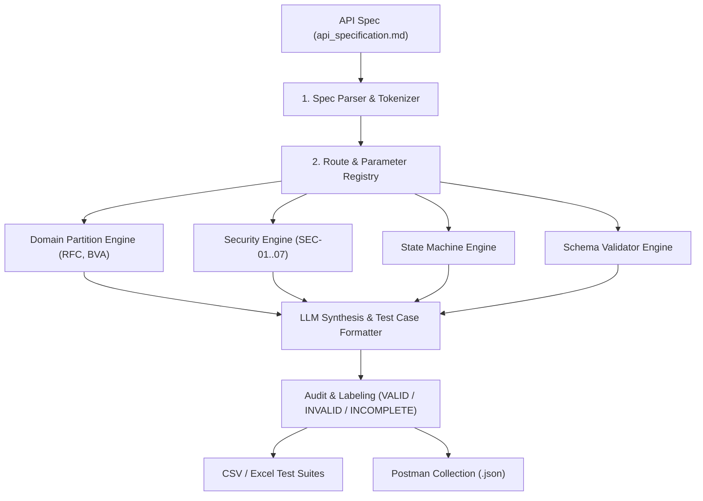

# API Test Generator Agent Skill

## 1. Overview
This Agent Skill autonomously generates structured API test cases directly from API specification documents (`api_specification.md` or OpenAPI/Swagger JSON). It generates test cases partitioned across 4 critical testing pillars:
1. **Domain Partitions & Boundary Value Analysis (BVA)**
2. **State Machine & Transition Rules**
3. **Security Vulnerabilities (SEC-01..SEC-07: SQLi, Broken Access Control, Privilege Escalation, Price Tampering)**
4. **Schema & Data Type Validation**

---

## 2. When to Use This Skill
Activate this skill when:
- You need to generate API test cases for a new backend service or endpoint.
- You want to convert a markdown/OpenAPI specification into structured CSV/JSON test suites.
- You need to generate Postman v2.1.0 collections with automated pre-request authentication and assertions.
- You want to audit AI-generated test cases against actual backend code implementation flaws.

---

## 3. Architecture & Workflow



---

## 4. How to Run the Generator

Run the generator script with Python 3:

```bash
# Basic run on default API specification
python .agents/skills/api-test-generator/scripts/generator.py --spec eshop-sut/api_specification.md --output reports/generated_test_suite.json

# Run with custom student ID and export format
python .agents/skills/api-test-generator/scripts/generator.py --spec eshop-sut/api_specification.md --student-id 23127540 --csv test_cases/
```

---

## 5. Test Case Taxonomy & Rules

### Domain Partitions
- **Happy Path:** Valid data types within expected limits (e.g. price > 0, valid email format).
- **Equivalence Classes:** Missing required fields, empty strings, whitespace, unicode/accents.
- **Boundary Values:** Zero (`0`), negative values (`-1`), 64-bit integer overflow, single space.

### Security (SEC-01 to SEC-07)
- **SEC-01 (Broken Access Control):** Unauthenticated access (no header) & Normal user token on `/api/admin/*`.
- **SEC-02 (SQL Injection):** Parameterized binding test on search query `?search=' OR '1'='1'--` and path parameters.
- **SEC-03 (Token Forgery):** Expired tokens, invalid signature, `alg: none` header.
- **SEC-04 (Privilege Escalation):** Mass assignment `PUT /api/users/me` with `role: "admin"`.
- **SEC-05 (Price Tampering):** Client-supplied item price lower than DB catalog price in `POST /api/cart`.
- **SEC-06 (Order State Flaw):** Transitioning order from `canceled` directly to `delivered`.

---

## 6. Output Artifacts Produced
- `test_cases/FR01_Account_Registration.csv` (≥ 40 cases)
- `test_cases/FR06_Product_Detail.csv` (≥ 40 cases)
- `test_cases/FR07_Shopping_Cart.csv` (≥ 40 cases)
- `test_cases/FR12_Access_Control.csv` (≥ 40 cases)
- `postman/EShop_HW06_Collection.json` (Automated tests with `X-Student-Id`)
