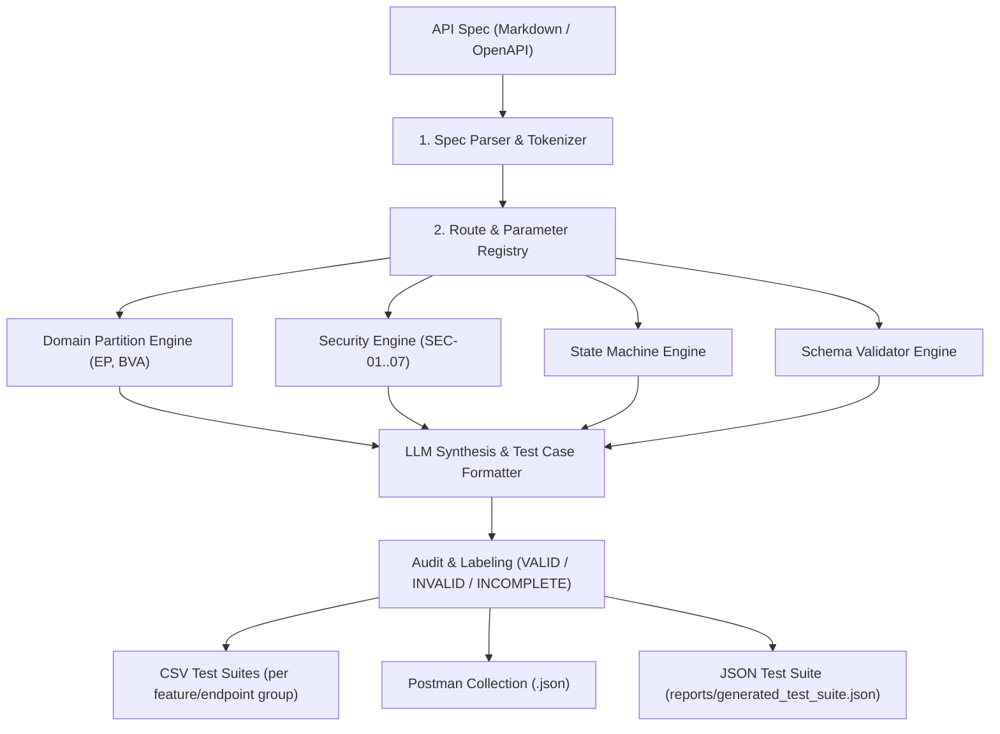

# API Test Generator Agent Skill

## 1. Overview
This Agent Skill autonomously generates structured API test cases directly from API specification documents (`api_specification.md` or OpenAPI/Swagger JSON). It works with **any REST API** regardless of domain or feature set. Test cases are partitioned across 4 critical testing pillars:
1. **Domain Partitions & Boundary Value Analysis (BVA)**
2. **State Machine & Transition Rules**
3. **Security Vulnerabilities (SEC-01..SEC-07: SQLi, Broken Access Control, Privilege Escalation, Price Tampering)**
4. **Schema & Data Type Validation**

---

## 2. When to Use This Skill
Activate this skill when:
- You need to generate API test cases for **any backend service or endpoint** (not limited to EShop).
- You want to convert a Markdown or OpenAPI/Swagger specification into structured CSV/JSON test suites.
- You need to generate a Postman v2.1.0 Collection with automated pre-request authentication and assertions.
- You want to audit AI-generated test cases against actual backend code implementation flaws.
- You want to add Human Extension test cases covering vulnerabilities that AI missed.

> **Examples of supported targets:** E-commerce APIs, Auth services, Order management, Content APIs, Admin dashboards, GraphQL APIs (via REST wrapper).

---

## 3. Architecture & Workflow



---

## 4. How to Run the Generator

The skill has **two execution modes**:

### Mode 1: Agent Skill CLI (any spec, any project)
```bash
# Generate JSON test suite from any API spec:
python .agents/skills/api-test-generator/scripts/generator.py \
    --spec path/to/api_specification.md \
    --output reports/generated_test_suite.json \
    --student-id <YOUR_ID>

# Example for EShop SUT:
python .agents/skills/api-test-generator/scripts/generator.py \
    --spec eshop-sut/api_specification.md \
    --output reports/generated_test_suite.json \
    --student-id 23127540
```

### Mode 2: Full Generation Engine (EShop — 160 test cases + CSV)
```bash
# Generates all CSV files for each feature group:
python test_generator/test_generator.py
```

---

## 5. Test Case Taxonomy & Rules

### Domain Partitions
- **Happy Path:** Valid data types within expected limits (e.g. price > 0, valid email format).
- **Equivalence Classes:** Missing required fields, empty strings, whitespace-only, unicode/accents.
- **Boundary Values:** Zero (`0`), negative values (`-1`), 64-bit integer overflow, single space, max length+1.

### Security (SEC-01 to SEC-07)
- **SEC-01 (Broken Access Control):** Unauthenticated access (no header) & normal user token on admin-only endpoints.
- **SEC-02 (SQL Injection):** Parameterized binding test: `?search=' OR '1'='1'--` in query & path params.
- **SEC-03 (Token Forgery):** Expired tokens, invalid signature, `alg: none` JWT header bypass.
- **SEC-04 (Privilege Escalation):** Mass assignment with `role: "admin"` on profile update endpoints.
- **SEC-05 (Price Tampering):** Client-supplied item price lower than server-side catalog price.
- **SEC-06 (Order State Flaw):** Illegal state machine transitions (e.g. `canceled` → `delivered`).
- **SEC-07 (Information Disclosure):** Verbose error messages leaking internal stack traces, DB schema, or file paths.

### State Machine Rules
- Terminal states (e.g. `canceled`, `completed`) **MUST NOT** transition to active states.
- Transitions must follow defined flow: `pending → processing → shipped → delivered`.
- Each state transition test should include: valid transition, invalid transition (skip step), and reverse transition.

---

## 6. Input Requirements

| Input | Format | Required | Description |
| :--- | :---: | :---: | :--- |
| API Specification | Markdown / OpenAPI JSON/YAML | ✅ | Must list endpoints with method, path, auth, request/response schema |
| Student/Project ID | String | Optional | Injected into `X-Student-Id` header of every request |
| Base URL | String | Optional | Default: `http://localhost:3000` |
| Feature Groups | Comma-separated | Optional | Filter test generation to specific feature IDs (e.g. `FR-01,FR-06`) |

---

## 7. Output Artifacts Produced

| Script | Output File | Description |
| :--- | :--- | :--- |
| `generator.py` (CLI) | `reports/generated_test_suite.json` | Generic JSON test suite — works for any API spec |
| `test_generator.py` (Full Engine) | `test_cases/<FEATURE_ID>_<Feature_Name>.csv` | One CSV file per feature group (e.g. `FR01_Account_Registration.csv`) |
| `test_generator.py` (Full Engine) | `test_cases/Test_Cases_Specification.md` | Master Markdown report with executed results (Expected vs Actual) |
| Manual Export | `postman/<Project>_Collection.json` | Postman Collection v2.1.0 with `X-Student-Id` header + automated assertions |
| CI/CD | `reports/newman_report.html` | Newman HTML Extra report generated by GitHub Actions pipeline |
