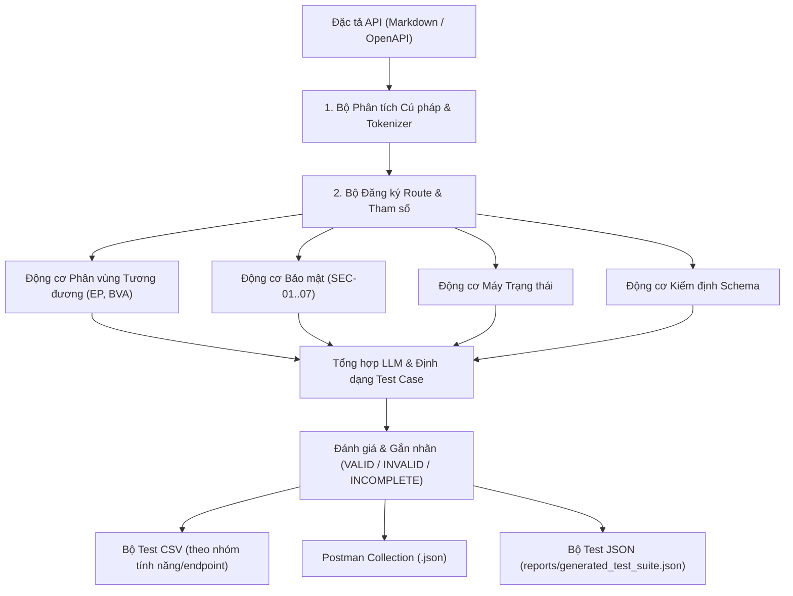

# Agent Skill — Bộ Sinh Test Case API Dựa Trên AI

## 1. Tổng Quan
Agent Skill này tự động sinh các kịch bản kiểm thử API có cấu trúc trực tiếp từ tài liệu đặc tả API (`api_specification.md` hoặc OpenAPI/Swagger JSON). Skill hoạt động với **bất kỳ REST API nào** bất kể miền nghiệp vụ hay tập tính năng. Kịch bản kiểm thử được phân chia theo **4 trụ cột kiểm thử chính**:
1. **Phân vùng Tương đương & Phân tích Giá trị Biên (BVA)**
2. **Máy trạng thái & Quy tắc Chuyển trạng thái**
3. **Lỗ hổng Bảo mật (SEC-01..SEC-07: SQLi, Broken Access Control, Privilege Escalation, Price Tampering)**
4. **Kiểm định Schema & Kiểu dữ liệu**

---

## 2. Khi Nào Sử Dụng Skill Này
Kích hoạt skill này khi:
- Cần sinh kịch bản kiểm thử API cho **bất kỳ dịch vụ backend hoặc endpoint nào** (không giới hạn với EShop).
- Muốn chuyển đổi đặc tả Markdown hoặc OpenAPI/Swagger thành bộ kiểm thử CSV/JSON có cấu trúc.
- Cần sinh Postman Collection v2.1.0 với pre-request authentication tự động và các assertions kiểm tra.
- Muốn đối soát (Audit) các test case do AI sinh so với lỗi thực tế trong mã nguồn backend.
- Muốn bổ sung các ca kiểm thử mở rộng do con người viết để phủ các lỗ hổng mà AI bỏ sót.

> **Các hệ thống mục tiêu được hỗ trợ:** API thương mại điện tử, Dịch vụ xác thực, Quản lý đơn hàng, API nội dung, Bảng quản trị Admin, API GraphQL (thông qua REST wrapper).

---

## 3. Kiến Trúc & Quy Trình Xử Lý



---

## 4. Cách Thực Thi Generator

Skill có **hai chế độ thực thi**:

### Chế độ 1: Agent Skill CLI (dùng cho bất kỳ API nào)
```bash
# Sinh bộ test JSON từ bất kỳ đặc tả API nào:
python .agents/skills/api-test-generator/scripts/generator.py \
    --spec path/to/api_specification.md \
    --output reports/generated_test_suite.json \
    --student-id <MSSV_CUA_BAN>

# Ví dụ với EShop SUT:
python .agents/skills/api-test-generator/scripts/generator.py \
    --spec eshop-sut/api_specification.md \
    --output reports/generated_test_suite.json \
    --student-id 23127540
```

### Chế độ 2: Động cơ Sinh Đầy Đủ (EShop — 160 test cases + CSV)
```bash
# Sinh tất cả file CSV cho từng nhóm tính năng:
python test_generator/test_generator.py
```

---

## 5. Phân Loại & Quy Tắc Kịch Bản Kiểm Thử

### Phân vùng Tương đương (EP)
- **Đường hạnh phúc (Happy Path):** Dữ liệu hợp lệ trong giới hạn cho phép (ví dụ: giá > 0, định dạng email đúng).
- **Lớp tương đương:** Thiếu trường bắt buộc, chuỗi rỗng, chỉ khoảng trắng, ký tự unicode/dấu tiếng Việt.
- **Giá trị biên (BVA):** Giá trị không (`0`), âm (`-1`), tràn số nguyên 64-bit, dấu cách đơn, độ dài tối đa + 1.

### Bảo mật (SEC-01 đến SEC-07)
- **SEC-01 (Broken Access Control):** Truy cập không xác thực (không có header) & token user thường trên endpoint `/api/admin/*`.
- **SEC-02 (SQL Injection):** Kiểm thử binding tham số hoá: `?search=' OR '1'='1'--` trong query và path params.
- **SEC-03 (Token Forgery — Giả mạo Token):** Token hết hạn, chữ ký không hợp lệ, JWT bypass `alg: none`.
- **SEC-04 (Privilege Escalation — Leo thang đặc quyền):** Mass assignment với `role: "admin"` trên endpoint cập nhật hồ sơ.
- **SEC-05 (Price Tampering — Giả mạo giá):** Giá sản phẩm do client cung cấp thấp hơn giá trong CSDL server.
- **SEC-06 (Order State Flaw — Lỗi máy trạng thái):** Chuyển trạng thái đơn hàng bất hợp lệ (ví dụ: `canceled` → `delivered`).
- **SEC-07 (Information Disclosure — Lộ thông tin):** Thông báo lỗi chi tiết tiết lộ stack trace, schema CSDL, hoặc đường dẫn file hệ thống.

### Quy Tắc Máy Trạng thái
- Các trạng thái kết thúc (ví dụ: `canceled`, `completed`) **PHẢI KHÔNG** được chuyển sang trạng thái hoạt động.
- Chuyển trạng thái phải theo đúng luồng đã định nghĩa: `pending → processing → shipped → delivered`.
- Mỗi ca kiểm thử chuyển trạng thái cần bao gồm: chuyển hợp lệ, chuyển bất hợp lệ (bỏ qua bước), và chuyển ngược chiều.

---

## 6. Yêu Cầu Đầu Vào

| Đầu vào | Định dạng | Bắt buộc | Mô tả |
| :--- | :---: | :---: | :--- |
| Đặc tả API | Markdown / OpenAPI JSON/YAML | ✅ | Phải liệt kê endpoint với method, path, auth, schema request/response |
| MSSV / Project ID | Chuỗi | Tuỳ chọn | Được chèn vào header `X-Student-Id` của mọi request |
| Base URL | Chuỗi | Tuỳ chọn | Mặc định: `http://localhost:3000` |
| Nhóm Tính năng | Danh sách phân cách bởi dấu phẩy | Tuỳ chọn | Lọc để chỉ sinh test cho các Feature ID cụ thể (ví dụ: `FR-01,FR-06`) |

---

## 7. Kết Quả Đầu Ra

| Script | File Đầu Ra | Mô tả |
| :--- | :--- | :--- |
| `generator.py` (CLI) | `reports/generated_test_suite.json` | Bộ test JSON tổng quát — dùng cho bất kỳ đặc tả API nào |
| `test_generator.py` (Động cơ Đầy Đủ) | `test_cases/<FEATURE_ID>_<Feature_Name>.csv` | Một file CSV cho mỗi nhóm tính năng (ví dụ: `FR01_Account_Registration.csv`) |
| `test_generator.py` (Động cơ Đầy Đủ) | `test_cases/Test_Cases_Specification.md` | Báo cáo Markdown tổng hợp với kết quả thực thi (Expected vs Actual) |
| Xuất thủ công | `postman/<Project>_Collection.json` | Postman Collection v2.1.0 với header `X-Student-Id` + assertions tự động |
| CI/CD (GitHub Actions) | `reports/newman_report.html` | Báo cáo Newman HTML Extra được tạo bởi pipeline GitHub Actions |
