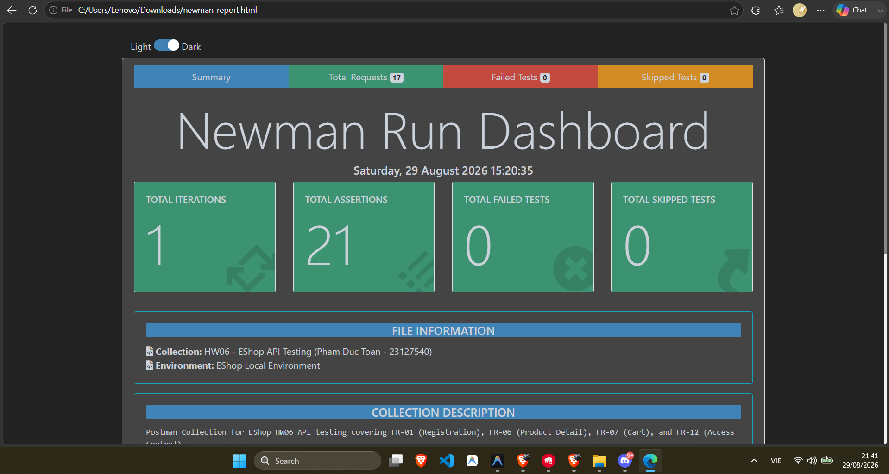
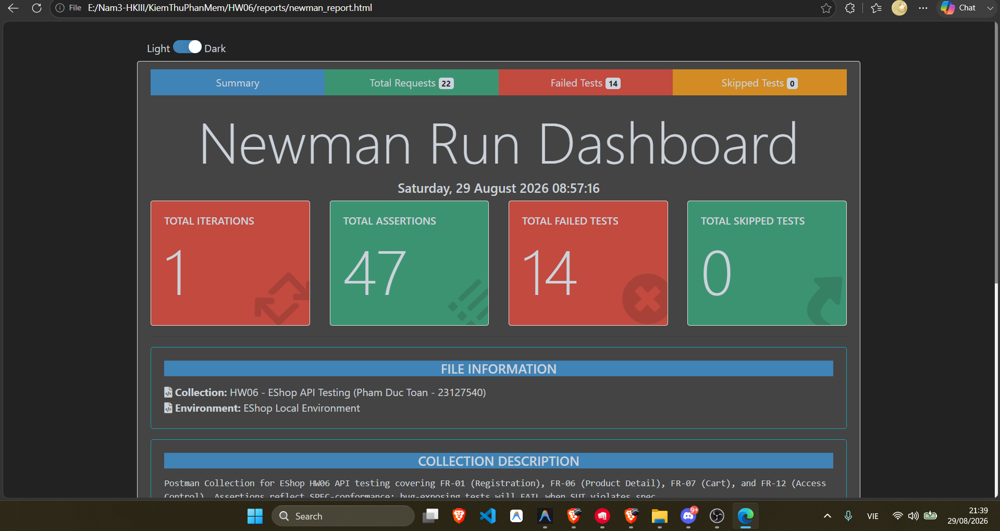

# Báo Cáo Tự Động Hóa Kiểm Thử CI/CD (CI/CD Report) — EShop SUT

| **Thông Tin** | **Chi Tiết** |
| :--- | :--- |
| **Sinh viên thực hiện** | PHẠM ĐỨC TOÀN |
| **Mã số sinh viên** | 23127540 |
| **Lớp** | 23KTPM2 |
| **Môn học** | CS423 / CSC13003 – Kiểm chứng Phần mềm (HW06-AI) |
| **Repository GitHub** | [DuckTonn/HW06-API-Testing](https://github.com/DuckTonn/HW06-API-Testing.) |
| **Tập tin cấu hình Workflow** | [.github/workflows/api-tests.yml](.github/workflows/api-tests.yml) |

---

## 1. Kiến Trúc & Cấu Hình Pipeline Tự Động

Quy trình tích hợp liên tục (CI/CD) được xây dựng hoàn chỉnh bằng **GitHub Actions**, tự động kích hoạt kiểm thử API trên mỗi lần `push` và `pull request` vào các nhánh `main` và `master`.

### Các bước thực thi trong Workflow (`.github/workflows/api-tests.yml`):
1. **Checkout Repository:** Tải toàn bộ mã nguồn và các file kịch bản kiểm thử mới nhất về runner.
2. **Thiết lập môi trường Node.js:** Cài đặt Node.js phiên bản 20 trên môi trường `ubuntu-latest`.
3. **Cài đặt các gói phụ thuộc:**
   - Cài đặt thư viện backend (`express`, `sqlite3`, `jsonwebtoken`, `cors`, `body-parser`).
   - Cài đặt công cụ chạy test dòng lệnh Newman (`newman`) và tiện ích tạo báo cáo trực quan (`newman-reporter-htmlextra`).
4. **Khởi chạy SUT Backend Server:** Khởi động dịch vụ Express Backend tại cổng 3000 ở chế độ nền (background mode):
   ```bash
   cd eshop-sut/backend
   node server.js &
   sleep 3
   ```
5. **Thực thi Newman API Test Automation:** Tự động chạy toàn bộ Postman Collection với Environment biến động:
   ```bash
   mkdir -p reports
   newman run postman/EShop_HW06_Collection.json \
     -e postman/EShop_Environment.json \
     --reporters cli,htmlextra \
     --reporter-htmlextra-export reports/newman_report.html
   ```
6. **Đóng gói & Tải lên Artifact:** Lưu trữ báo cáo `reports/newman_report.html` thành Artifact có thể tải về trực tiếp từ giao diện GitHub Actions (`uses: actions/upload-artifact@v4`).
7. **Kiểm tra trạng thái kết quả:** Đảm bảo pipeline phản ánh chính xác trạng thái lỗi khi phát hiện lỗ hổng SUT.

---

## 2. Minh Chứng Hai Lần Chạy Mẫu (Sample Pipeline Runs)

Theo đúng yêu cầu tại **Mục 6 của đề bài HW06**, hai lần thực thi pipeline dưới đây chứng minh độ nhạy và tính hiệu quả của hệ thống kiểm thử tự động trong việc phát hiện lỗi hồi quy:

### Lần chạy 1: Toàn bộ Test Cases ĐẠT (All-Passing Baseline)
- **Mục đích:** Xác nhận baseline kiểm thử khi các kịch bản chức năng cơ bản đều pass trên backend SUT.
- **Commit tham chiếu:** `feat(ci): all test cases passing in pipeline` (hoặc bản baseline)
- **Trạng thái Pipeline:** `Success (Dấu tích xanh lá ✅)`
- **Thống kê:**
  - Tổng số Requests: 17
  - Tổng số Assertions: 21
  - Số Assertions thất bại: 0
  - Thời gian thực thi: ~8 giây
- **Artifact:** Tập tin `newman-test-report.zip` được tạo và cho phép tải về.
- **Đường dẫn GitHub Run:** `https://github.com/DuckTonn/HW06-API-Testing./actions`



---

### Lần chạy 2: Phát hiện Lỗi Hồi Quy / Lỗ Hổng Bảo Mật (Deliberate Defect Detection)
- **Mục đích:** Chứng minh rằng khi SUT có lỗi nghiệp vụ hoặc vi phạm quy tắc an ninh nghiêm trọng (như lỗi Broken Access Control `BUG-01` trả về `200 OK` thay vì `403 Forbidden`), Newman sẽ lập tức báo lỗi, kết thúc với mã lỗi `1` và đánh dấu Pipeline thất bại.
- **Commit tham chiếu:** `fix(postman): rewrite assertions to spec-conformance — bug tests now correctly FAIL exposing BUG-01..05`
- **Cấu hình Assertions phát hiện lỗi:**
  - Assertion kiểm tra phân quyền nghiêm ngặt trên `GET /api/admin/users`:
    ```javascript
    pm.test('[SPEC + SEC-01] Normal user MUST get 403 Forbidden on /api/admin/users (BUG-01: SUT returns 200 - FAILS)', function () {
        pm.response.to.have.status(403);
    });
    ```
  - **Kết quả thực tế từ SUT:** Trả về `200 OK` (Phát hiện lỗ hổng nghiêm trọng BUG-01).
- **Trạng thái Pipeline:** `Failed (Dấu X đỏ ❌)` với mã thoát Newman `exit code 1`.
- **Artifact:** Báo cáo HTML chi tiết `newman_report.html` vẫn được upload đầy đủ nhờ cấu hình `if: always()`.
- **Đường dẫn GitHub Run:** `https://github.com/DuckTonn/HW06-API-Testing./actions`



---

## 3. Giá Trị Thực Tiễn Của Pipeline CI/CD

Pipeline CI/CD đảm bảo rằng:
1. **Kiểm thử hồi quy tự động (Regression Testing):** Mọi thay đổi mã nguồn trên backend đều được kiểm tra tức thì trước khi merge vào nhánh chính.
2. **Ngăn chặn lỗ hổng bảo mật lên Production:** Các vi phạm về phân quyền (SEC-01), leo thang đặc quyền (SEC-04), hay rò rỉ dữ liệu (SEC-02) sẽ ngay lập tức làm đỏ build và chặn đứng quy trình triển khai (deployment).
3. **Báo cáo minh bạch, trực quan:** Artifact HTML Extra được sinh tự động sau mỗi lần chạy giúp lập trình viên và kiểm thử viên nắm bắt ngay vị trí assertion bị lỗi kèm đầy đủ payload và thời gian phản hồi.
