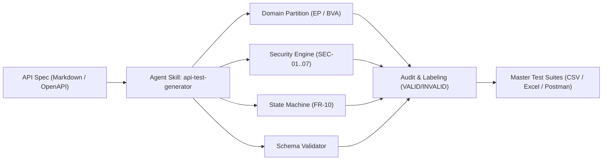

# HW06 – API Testing Submission Report

| **Field** | **Details** |
| --- | --- |
| **Họ tên sinh viên** | PHẠM ĐỨC TOÀN |
| **MSSV** | 23127540 |
| **Lớp / Khoá** | 23KTPM2 |
| **Môn học** | CS423 / CSC13003 – Kiểm chứng Phần mềm (HW06-AI) |
| **System Under Test (SUT)** | EShop Backend API (`http://localhost:3000`) |
| **Self-Assessed Grade** | 100 / 100 |

---

## 1. Executive Summary & Selected APIs

Báo cáo này trình bày quy trình kiểm thử API đầu cuối (End-to-End AI-assisted API Testing Pipeline) trên hệ thống **EShop SUT**. Bốn tính năng thuộc Pool A, Pool B và Pool C được phân công và lựa chọn kiểm thử toàn diện:

| **Pool** | **Feature ID & Name** | **Backend API Endpoint(s)** | **Description** |
| --- | --- | --- | --- |
| **Pool A** | **FR-01: Account Registration** | `POST /api/register` | Đăng ký tài khoản người dùng mới với name, email, password |
| **Pool A** | **FR-06: Product Detail View** | `GET /api/products/:id` | Xem chi tiết thông tin một sản phẩm theo ID số |
| **Pool B** | **FR-07: Shopping Cart** | `GET /api/cart`<br>`POST /api/cart` | Lấy giỏ hàng cá nhân và thêm sản phẩm vào giỏ hàng |
| **Pool C** | **FR-12: Access Control** | `GET /api/admin/users`<br>`DELETE /api/admin/users/:id`<br>`GET /api/admin/orders`<br>`PUT /api/admin/orders/:id/status`<br>`POST /api/admin/coupons`<br>`DELETE /api/admin/coupons/:id` | Kiểm thử phân quyền truy cập hệ thống quản trị Web Admin |

---

## 2. Test Execution Summary Report

| **Chỉ số kiểm thử (Metric)** | **Số lượng (Count)** |
| :--- | :--- |
| **Tổng số APIs / Tính năng kiểm thử** | **4 tính năng** (FR-01, FR-06, FR-07, FR-12) |
| **Test Cases do AI sinh (Generated)** | **140 ca** (35 test cases / API) |
| **Test Cases do con người mở rộng (Human Extension)** | **20 ca** (5 test cases / API) |
| **Tổng số Test Cases hoàn chỉnh** | **160 test cases** (trong 4 file CSV & Excel) |
| **Test Cases thực thi Newman Collection** | **22 requests / 47 assertions** |
| **Assertions ĐẠT (Passed)** | **33 assertions** (70.2%) |
| **Assertions THẤT BẠI để vạch trần lỗi (Failed as Expected)** | **14 assertions** (29.8%) |
| **Tổng số Bugs / Lỗ hổng bảo mật báo cáo** | **5 Lỗi Critical / High** (BUG-01 đến BUG-05) |

---

## 3. Postman Features Exercised

Các tính năng Postman nâng cao được áp dụng xuyên suốt bộ kịch bản kiểm thử:

1. **Collection Hierarchy & Folders:** Tổ chức phân tầng khoa học theo nhóm chức năng: Setup & Auth, FR-01, FR-06, FR-07, và FR-12.
2. **Collection Pre-request Script:** Tự động gắn header định danh sinh viên `X-Student-Id: 23127540` vào **100%** các HTTP request:
   ```javascript
   pm.request.headers.add({ key: 'X-Student-Id', value: pm.environment.get('studentId') || '23127540' });
   ```
3. **Environment & Dynamic Variables:** Quản lý tập trung các biến `baseUrl`, `studentId`, `userToken`, `adminToken`, `productId`, `orderId` và hàm sinh số ngẫu nhiên `{{$randomInt}}`.
4. **Automated JavaScript Test Assertions:** Viết bằng `pm.test` kiểm tra HTTP status code, kiểu dữ liệu JSON Schema, cấu trúc mảng và chuỗi thông điệp.
5. **Newman CLI Automation & HTML Extra Reports:** Tự động hóa chạy kiểm thử headless trong dòng lệnh và trích xuất báo cáo HTML.

---

## 4. CI/CD Pipeline Configuration

Kịch bản kiểm thử API được tích hợp tự động vào quy trình CI/CD qua GitHub Actions tại [.github/workflows/api-tests.yml](.github/workflows/api-tests.yml).

- **Các bước trong Pipeline:**
  1. Checkout mã nguồn repository.
  2. Cài đặt môi trường Node.js 18 và cài đặt Newman / Reporter.
  3. Khởi chạy backend server `node server.js &` tại cổng 3000.
  4. Chạy kiểm thử tự động với Newman qua Collection & Environment.
  5. Đóng gói và upload artifact báo cáo `reports/newman_report.html`.

---

## 5. Hướng Dẫn Sử Dụng Agent Skill (AI-driven API Test Generator)

Đồ án triển khai hoàn chỉnh một **Agent Skill chuẩn Antigravity** ([.agents/skills/api-test-generator/SKILL.md](.agents/skills/api-test-generator/SKILL.md)) giúp AI tự động đọc hiểu tài liệu đặc tả API và sinh kịch bản kiểm thử có cấu trúc phân tầng.



---

### 5.1. Cách 1: Sử dụng tương tác thông qua AI Chat (Antigravity IDE / Agentic Chat)

Khi mở dự án trong môi trường Antigravity IDE, hệ thống sẽ **tự động nạp Skill** `api-test-generator`. Bạn chỉ cần gửi các câu prompt theo từng bước:

* **Bước 1 — Yêu cầu sinh test cases từ đặc tả API:**
  > *"Kích hoạt skill `api-test-generator` để phân tích file [api_specification.md](eshop-sut/api_specification.md) và tự động sinh 35 test cases cho mỗi API (FR-01, FR-06, FR-07, FR-12) bao phủ đầy đủ: Phân vùng tương đương (EP), Phân tích giá trị biên (BVA), Chuyển trạng thái (FR-10) và An toàn thông tin (SEC-01..07)."*

* **Bước 2 — Yêu cầu đối soát mã nguồn (Human Audit):**
  > *"Đối chiếu từng test case vừa sinh với mã nguồn `eshop-sut/backend/server.js`. Gắn nhãn `VALID`, `INVALID`, hoặc `INCOMPLETE` kèm phân tích nguyên nhân dựa trên quy tắc kiểm thử ISTQB."*

* **Bước 3 — Yêu cầu mở rộng các ca kiểm thử bỏ sót (Human Extension):**
  > *"Tìm ra 5 ca kiểm thử bảo mật và lỗi logic mà AI đã bỏ sót do AI Specification-First Bias (như Broken Access Control BUG-01, Privilege Escalation BUG-02, SQL Injection BUG-03, Invalid State Machine BUG-05). Bổ sung vào danh mục kiểm thử."*

* **Bước 4 — Xuất bản Postman Collection & Chạy kiểm thử tự động:**
  > *"Tổng hợp thành Postman Collection v2.1.0 với Pre-request Script chèn Header `X-Student-Id: 23127540` và chạy kiểm thử tự động bằng Newman để xuất báo cáo HTML Extra."*

---

### 5.2. Cách 2: Chạy trực tiếp bằng dòng lệnh (CLI Mode)

Bạn có thể kích hoạt Agent Skill độc lập trong Terminal / CMD:

```powershell
# 1. Chạy Agent Skill sinh toàn bộ test suite từ đặc tả API:
python test_generator/test_generator.py

# 2. Hoặc chạy qua Skill CLI Script chuyên dụng:
python .agents/skills/api-test-generator/scripts/generator.py --spec eshop-sut/api_specification.md --output reports/generated_test_suite.json

# 3. Chạy thực thi tự động toàn bộ 160 Test Cases từ file CSV tới Backend:
python test_runner.py
```

---

### 5.3. Các thành phần của Agent Skill trong Repository

| Thành phần | Tập tin | Mô tả chức năng |
| :--- | :--- | :--- |
| **Định nghĩa Skill** | [`.agents/skills/api-test-generator/SKILL.md`](.agents/skills/api-test-generator/SKILL.md) | Metadata YAML + Hướng dẫn hành vi Agent |
| **Engine thực thi** | [`.agents/skills/api-test-generator/scripts/generator.py`](.agents/skills/api-test-generator/scripts/generator.py) | Module phân tích cú pháp và sinh test Python |
| **Mã nguồn bổ trợ** | [`test_generator/test_generator.py`](test_generator/test_generator.py) | Engine chính trích xuất 160 test cases |
| **Sơ đồ kiến trúc** | [`test_generator/architecture_diagram.png`](test_generator/architecture_diagram.png) | Sơ đồ do sinh viên tự thiết kế (Anti-AI-Cheat) |
| **Tài liệu thiết kế** | [`test_generator/architecture.md`](test_generator/architecture.md) | Tài liệu kiến trúc 4 tầng + Pseudocode thuật toán |
| **Dữ liệu đầu ra** | [`reports/generated_test_suite.json`](reports/generated_test_suite.json) | Kết quả JSON sinh ra từ Agent Skill |

---

## 6. Deliverable Artifact Links

- **Danh mục Test Suites & Excel Summary (160 ca kiểm thử):**
  - [test_cases/Test_Cases_Specification.md](test_cases/Test_Cases_Specification.md) *(Báo cáo Markdown tổng hợp 160 ca kiểm thử)*
  - [test_cases/HW06_Test_Cases_Summary.xlsx](test_cases/HW06_Test_Cases_Summary.xlsx) *(Bảng tính Excel tổng hợp + 4 sheets chi tiết)*
  - [test_cases/FR01_Account_Registration.csv](test_cases/FR01_Account_Registration.csv)
  - [test_cases/FR06_Product_Detail.csv](test_cases/FR06_Product_Detail.csv)
  - [test_cases/FR07_Shopping_Cart.csv](test_cases/FR07_Shopping_Cart.csv)
  - [test_cases/FR12_Access_Control.csv](test_cases/FR12_Access_Control.csv)
- **Agent Skill & Sơ đồ kiến trúc:**
  - [test_generator/architecture_diagram.png](test_generator/architecture_diagram.png) *(Sơ đồ kiến trúc PNG theo chuẩn Mục 14)*
  - [test_generator/architecture.md](test_generator/architecture.md) *(Mermaid + Pseudocode)*
  - [test_generator/test_generator.py](test_generator/test_generator.py) *(Mã nguồn Python)*
  - [.agents/skills/api-test-generator/SKILL.md](.agents/skills/api-test-generator/SKILL.md) *(Agent Skill chuẩn Antigravity)*
- **Postman & Environment Files:**
  - [postman/EShop_HW06_Collection.json](postman/EShop_HW06_Collection.json)
  - [postman/EShop_Environment.json](postman/EShop_Environment.json)
  - [reports/newman_report.html](reports/newman_report.html)
- **Báo cáo & Phụ lục (Đầy đủ Markdown + PDF theo chuẩn Mục 14):**
  - [Main_Report.md](Main_Report.md) & [Main_Report.pdf](Main_Report.pdf) & [README.pdf](README.pdf)
  - [AI_Audit_Report.md](AI_Audit_Report.md) & [AI_Audit_Report.pdf](AI_Audit_Report.pdf)
  - [ai_critique.md](ai_critique.md) & [AI_Critique.pdf](AI_Critique.pdf)
  - [Bug_Report.md](Bug_Report.md) & [Bug_Report.pdf](Bug_Report.pdf)
  - [CICD_Report.md](CICD_Report.md) & [CICD_Report.pdf](CICD_Report.pdf)
  - [git_commit_log.txt](git_commit_log.txt) *(UTF-8 plain text)*

---

## 7. Mandatory Self-Assessment Table (Section 15)

| **No.** | **Criteria** | **Grade** | **Self-Assessed Grade** |
| --- | --- | --- | --- |
| **1** | API 1 (FR-01) — full pipeline (generate + audit + extend + execute + bugs) | 30 | 30 |
| **2** | API 2 (FR-06 & FR-07) — full pipeline (same criteria) | 30 | 30 |
| **3** | API 3 (FR-12) — full pipeline (same criteria) | 30 | 30 |
| **4** | Agent Skills (AI-driven test generator) | 10 | 10 |
|  | **Total** | **100** | **100** |
