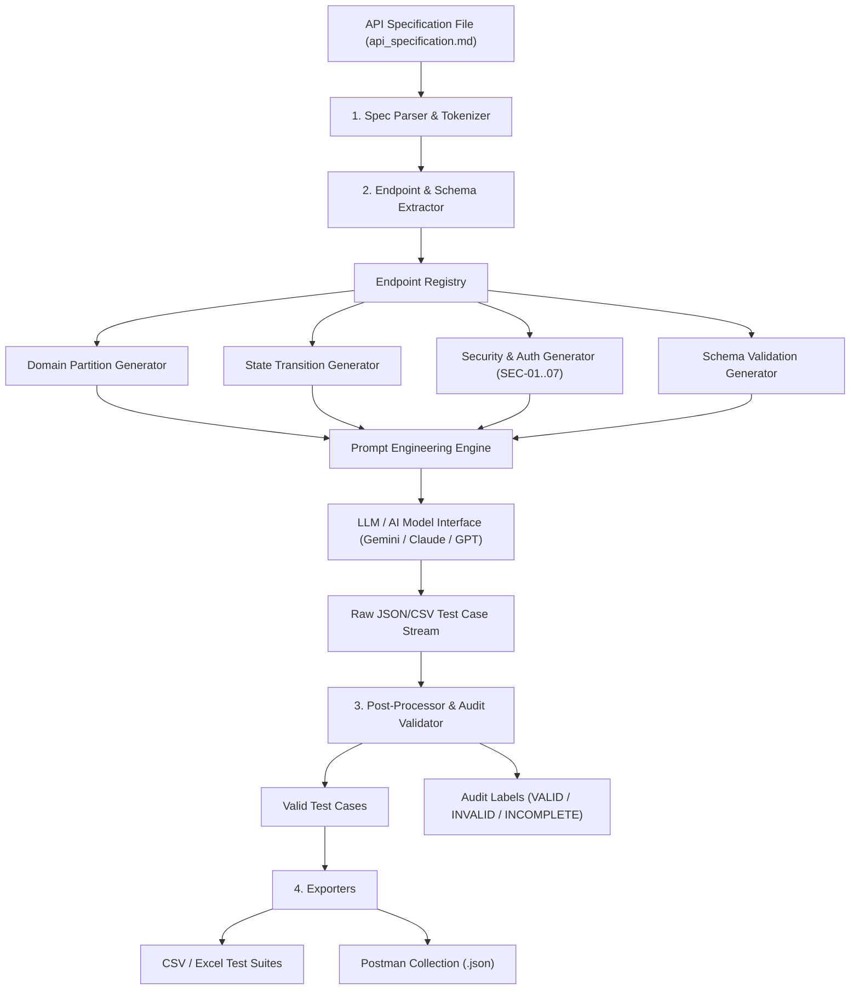

# AI-Driven API Test Generator — Architecture & Design

## 1. Overview
The **AI API Test Generator** is an automated agent skill designed to parse markdown API specifications (`api_specification.md` or OpenAPI/Swagger JSON), analyze endpoints, parameters, authentication requirements, and security rules (SEC-01–SEC-07), and automatically synthesize structured API test cases (Domain Partitions, State Transitions, Security, Schema Validation).

---

## 2. System Architecture Diagram



---

## 3. Step-by-Step Pseudocode Design

```python
"""
AI API Test Generator Pseudocode & Reference Implementation
Target SUT: EShop Backend API
Author: PHẠM ĐỨC TOÀN (StudentID: 23127540)
"""

import json
import re

class APISpecParser:
    def __init__(self, spec_filepath):
        self.filepath = spec_filepath
        self.endpoints = []

    def parse(self):
        # 1. Read spec file
        with open(self.filepath, 'r', encoding='utf-8') as f:
            content = f.read()

        # 2. Extract endpoints using regex patterns
        endpoint_blocks = re.findall(r'###\s+([\d\.]+)\s+(.*?)\n- \*\*Endpoint:\*\*\s+`(GET|POST|PUT|DELETE)\s+([^`]+)`', content)
        for section_num, title, method, path in endpoint_blocks:
            self.endpoints.append({
                "section": section_num,
                "title": title.strip(),
                "method": method,
                "path": path,
                "requires_auth": "Authorization" in content or "/admin/" in path or "/cart" in path
            })
        return self.endpoints

class APITestGenerator:
    def __init__(self, endpoints):
        self.endpoints = endpoints

    def generate_domain_partitions(self, endpoint):
        test_cases = []
        # Normal happy path
        test_cases.append({
            "id": f"{endpoint['method']}_VALID_01",
            "category": "Domain Partition",
            "desc": f"Valid happy path request to {endpoint['path']}",
            "method": endpoint['method'],
            "path": endpoint['path'],
            "expected_status": 200
        })
        # Boundary / Invalid inputs
        test_cases.append({
            "id": f"{endpoint['method']}_INVALID_02",
            "category": "Domain Partition",
            "desc": f"Empty string / missing payload on {endpoint['path']}",
            "method": endpoint['method'],
            "path": endpoint['path'],
            "expected_status": 400
        })
        return test_cases

    def generate_security_cases(self, endpoint):
        test_cases = []
        # Auth check
        if endpoint["requires_auth"]:
            test_cases.append({
                "id": f"{endpoint['method']}_SEC_UNAUTH",
                "category": "Security",
                "desc": f"Unauthenticated request to protected {endpoint['path']}",
                "method": endpoint['method'],
                "path": endpoint['path'],
                "headers": {},
                "expected_status": 401
            })
            if "/admin/" in endpoint["path"]:
                test_cases.append({
                    "id": f"{endpoint['method']}_SEC_ROLE_ESCALATION",
                    "category": "Security",
                    "desc": f"Normal user token accessing admin endpoint {endpoint['path']}",
                    "method": endpoint['method'],
                    "path": endpoint['path'],
                    "headers": {"Authorization": "Bearer <normal_user_token>"},
                    "expected_status": 403
                })
        # SQL Injection check
        test_cases.append({
            "id": f"{endpoint['method']}_SEC_SQLI",
            "category": "Security",
            "desc": f"SQL Injection attempt on {endpoint['path']}",
            "method": endpoint['method'],
            "path": endpoint['path'],
            "payload": {"search": "' OR '1'='1'--"},
            "expected_status": 400
        })
        return test_cases

    def run(self):
        all_test_cases = []
        for ep in self.endpoints:
            all_test_cases.extend(self.generate_domain_partitions(ep))
            all_test_cases.extend(self.generate_security_cases(ep))
        return all_test_cases

if __name__ == "__main__":
    parser = APISpecParser("eshop-sut/api_specification.md")
    endpoints = parser.parse()
    generator = APITestGenerator(endpoints)
    tests = generator.run()
    print(f"Successfully generated {len(tests)} test cases for {len(endpoints)} endpoints.")
```
